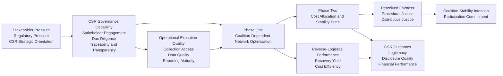
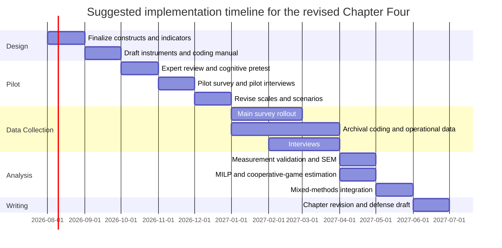

# Deep Research Report on Reviewing Chapters One Through Four and Expanding Chapter Four into a CSR-Focused Thesis Model

## Executive Summary

I reviewed the four chapter drafts you provided in `.tex` format rather than treating the chapter texts as unspecified. The dissertation already has a coherent internal logic: Chapter One frames CSR as a supply-chain coordination problem using EV battery recycling as the case context; Chapter Two organizes the literature into four model blocks; Chapter Three develops a bilateral manufacturer–retailer game with an endogenous stage‑zero regime-choice layer; and Chapter Four extends the problem into a multi-retailer reverse-logistics network solved in two phases through a coalition-dependent MILP and a Shapley cost-allocation game. The current architecture is analytically strong in operations research and game theory, but CSR is still modeled mostly as a cost, compliance, and efficiency problem rather than as a multidimensional governance, stakeholder, and disclosure problem. That is the main gap limiting the thesis’s contribution to the broader CSR literature.

The strongest way to expand Chapter Four into a more explicitly CSR-focused thesis is **not** to discard the existing two-phase model. Instead, it should be reframed as the operational core of a broader, multi-component CSR governance framework. In that revised model, upstream constructs such as **CSR strategic orientation, stakeholder pressure, due diligence maturity, traceability/transparency capability, and collaborative governance quality** shape downstream outcomes such as **collection participation, reverse-logistics performance, perceived fairness of cost allocation, coalition stability, and financial and legitimacy outcomes**. This move aligns the chapter with ISO 26000’s emphasis on stakeholder engagement and integration of social responsibility into organizational processes, GRI’s impact-based reporting model, and IFRS S1/S2’s governance–strategy–risk–metrics architecture. citeturn30view0turn31view0turn32view0turn32view3

Official standards now provide a very usable backbone for a CSR-focused thesis. ISO 26000 remains current after confirmation in 2025 and explicitly emphasizes principles and practices of social responsibility, integration across the organization, stakeholder engagement, and communication of commitments and performance. GRI’s revised Universal Standards have applied since January 2023 and are designed to help organizations report impacts on the economy, environment, and people, while incorporating human-rights and environmental due diligence. IFRS S1 and S2 have been effective since reporting periods beginning on or after January 1, 2024, and require disclosures on governance, strategy, risk-management processes, and performance/targets; IFRS S2 also builds on TCFD and incorporates industry-based disclosures derived from SASB Standards. citeturn30view0turn30view1turn31view0turn31view1turn32view0turn32view2

A CSR-centered Chapter Four should therefore become a **mixed-methods chapter** with three linked layers: a conceptual and measurement layer for CSR governance constructs; an operational optimization layer that retains the MILP for network design; and an allocation/behavior layer that tests fairness, participation, and coalition stability quantitatively and qualitatively. This is not only theoretically stronger. It also matches the real-world characteristics of EV battery stewardship, where formal collection channels, due-diligence obligations, recycling economics, and stakeholder trust all matter. U.S. EPA guidance underscores the operational seriousness of this context by stating that lithium-ion batteries should not go in household garbage or municipal recycling bins and that businesses often need to manage discarded lithium-ion batteries as hazardous waste, frequently under universal-waste rules. citeturn9view0

The revised Chapter Four draft later in this report therefore keeps your original two phases, but embeds them inside an expanded CSR governance model with constructs, hypotheses, measurement plans, validated instrument families, sampling and analysis strategies, robustness tests, ethical safeguards, and a clearer contribution to CSR theory, supply-chain governance, and circular economy research.

## Reading and Synthesis of Chapters One Through Four

Based on the uploaded drafts, Chapter One is already well positioned conceptually. It argues that CSR becomes economically meaningful only when translated into concrete supply-chain decisions about investment, channel power, cost bearing, and coordination. EV battery recycling is used as the application domain because it makes end-of-life responsibility visible and operationally consequential. The chapter’s overarching contribution is to define CSR not as a vague reputational preference but as a governance problem linking incentives, recycling maturity, reverse logistics, and cost allocation.

Chapter Two is logically organized and does useful dissertation-level positioning. Rather than offering a generic review, it maps the thesis into four model blocks: operational bilateral channel games; a stage-zero meta-game of endogenous regime choice; multi-retailer reverse-logistics network design; and cooperative-game cost allocation. This is a strength. It shows that the dissertation has a cumulative architecture rather than two unrelated essays.

Chapter Three is the theoretical bridge between general CSR strategy and the specific reverse-logistics application. It models a bilateral manufacturer–retailer channel where demand rises with CSR-driven recycling maturity and the retailer bears a convex investment cost. The analysis compares Vertical Nash, Manufacturer Stackelberg, Retailer Stackelberg, and integrated coordination, then adds a stage-zero game in which the parties choose whether to coordinate or seek leadership. This chapter’s main value is that it endogenizes governance structure before moving to the networked setting.

Chapter Four is currently titled as a CSR-based multi-retailer reverse-logistics network with Shapley cost sharing. It extends the dyadic logic in Chapter Three into a shared infrastructure problem. The current structure is clear and technically disciplined. Phase One solves a coalition-dependent MILP to minimize net CSR compliance cost, including collection, transport, facility-opening, processing, compliance infrastructure, and recovered-material value. Phase Two uses those coalition costs as the characteristic function in a cooperative cost game and allocates grand-coalition cost via the Shapley value. The chapter then checks efficiency, individual rationality, and selected core inequalities using a stylized U.S. case.

The four chapters are therefore **coherent as a dissertation**. The main issue is not structural inconsistency. The issue is that the thesis labels the problem “CSR” while the actual Chapter Four model operationalizes only a narrow subset of CSR content: cost, compliance support, processor access, and fairness of cost allocation. This creates a mismatch between the ambition of the introduction and literature review, and the narrower operationalization in the later modeling chapter.

## Critical Assessment of the Current Chapter Four Model

Your current Chapter Four has several genuine strengths. It links physical network design to cost allocation; it uses coalition-dependent costs rather than arbitrary exogenous sharing rules; it explicitly checks participation and stability rather than assuming fairness; and it chooses a highly relevant case context in EV battery recycling, where governance, compliance, and infrastructure are materially important. That is a credible operations-management contribution.

The main weaknesses are conceptual rather than mathematical. The model calls itself “CSR-based,” but CSR is treated primarily as **responsible treatment plus cost responsibility**. That is narrower than the dominant contemporary standards and governance frameworks. ISO 26000 frames social responsibility around principles, core subjects, stakeholder engagement, integration, and communication. GRI frames reporting around impacts on economy, environment, and people, with due diligence embedded. IFRS S1/S2 frame sustainability through governance, strategy, risk/opportunity management, and metrics/targets. The EU Corporate Sustainability Due Diligence Directive also explicitly ties responsible business conduct to due diligence across operations and value chains, drawing on the UN Guiding Principles and OECD guidance. citeturn30view0turn31view0turn31view1turn32view0turn32view3turn15view1

That gap has concrete implications. The current model does not measure or explain stakeholder engagement quality, procedural justice, transparency, traceability maturity, due-diligence capability, nor the reputational or legitimacy outcomes that often motivate CSR investment. It also treats manufacturer participation through reduced processor access costs or improved recovery values, but does not model how the manufacturer creates those improvements through governance routines, data sharing, auditability, contractual safeguards, or reporting systems.

A second weakness is the chapter’s heavy reliance on deterministic and static assumptions. Return volumes are fixed, costs are linear, planning is single-period, and coalition behavior is effectively one-shot. In real battery stewardship systems, battery chemistry mix, state-of-health uncertainty, event-driven recalls, regional regulation, logistics disruption, and commodity-price volatility matter. Recent open-access research on lithium-ion battery recycling shows that long-term recycling outcomes depend strongly on collection rates, technology evolution, cathode chemistry, and spatial optimization. In one 2025 Nature Communications study, the authors report that stabilizing supply under China’s long-run EV trajectory requires at least an 84% collection rate, and they identify inadequate infrastructure and unclear recycling responsibilities as a key practical barrier. citeturn29view0

A third weakness is the use of the Shapley value as the primary fairness mechanism without sufficient behavioral grounding. Mathematically, Shapley is elegant. Institutionally, however, cost-sharing schemes are accepted or rejected not only because of marginal contributions, but also because of perceived **procedural fairness, transparency, bargaining power, auditability, and legitimacy**. Your current discussion acknowledges that Shapley may violate individual rationality or core stability in some games, but the chapter does not connect those failures to governance remedies such as dispute-resolution procedures, phased subsidies, minimum-guarantee contracts, or hybrid allocation rules.

A fourth weakness is empirical thinness. The case study is explicitly stylized, which is perfectly appropriate for model illustration, but insufficient for a thesis that wants to make a broader CSR claim. The chapter would be much stronger if the current model were recast as one module inside a larger empirical design drawing on surveys, interviews, archival disclosures, and secondary operational data.

The practical implication is straightforward: **the chapter should remain game-theoretic and optimization-based, but it needs a front-end CSR measurement layer and a back-end empirical/behavioral validation layer**.

### Diagnosis of the main gaps

| Current feature in Chapter Four | Why it is useful | Why it is insufficient for a CSR-focused thesis | Required expansion |
|---|---|---|---|
| Coalition-dependent MILP | Strong operational realism for network design | Models CSR mostly as cost/compliance burden | Add CSR governance antecedents and execution capabilities |
| Shapley cost allocation | Transparent marginal-contribution fairness logic | Ignores procedural justice, trust, and acceptance | Add perceived fairness, trust, and coalition-stability constructs |
| Stylized U.S. case | Shows workflow clearly | Limited external validity and no measurement model | Add survey, archival, and interview data |
| Manufacturer support as lower cost / better access | Captures one CSR mechanism | Does not represent due diligence, traceability, or disclosure | Add governance and transparency variables |
| Participation/core checks | Good institutional realism | Static and purely economic | Add longitudinal and behavioral validation |

## CSR Frameworks, Standards, and Recent Evidence Most Relevant to the Expansion

A stronger Chapter Four should be grounded in four complementary intellectual pillars.

The first pillar is **stakeholder-oriented CSR theory**. Your dissertation already implicitly uses a stakeholder lens, because manufacturers, retailers, recyclers, consumers, regulators, and communities all bear different costs and benefits. That lens should be made explicit in Chapter Four. A useful move is to define CSR governance as the organizational capability to identify stakeholder-relevant impacts, allocate responsibility, and maintain legitimate cooperation under asymmetric incentives.

The second pillar is **due diligence and impact-based responsibility**. This is where current standards are especially useful. ISO 26000 emphasizes stakeholder engagement, integration of social responsibility, and communication of commitments and performance. GRI emphasizes impact materiality and due diligence across people, environment, and economy. The EU’s 2024 Corporate Sustainability Due Diligence Directive explicitly points to operations and value chains and references the UN Guiding Principles and OECD due-diligence logic. These sources collectively support treating battery take-back, traceability, safe handling, human-rights screening in upstream material chains, and circular-economy recovery as part of one broader CSR governance system rather than separate compliance silos. citeturn30view0turn30view1turn31view0turn31view1turn15view1

The third pillar is **disclosure and metrics architecture**. IFRS S1 and S2 require disclosure on governance, strategy, risk management, and performance/targets. IFRS S2 specifically addresses climate-related physical and transition risks and incorporates industry-based SASB content. GRI’s modular system adds due-diligence and impact reporting. Together, these can be translated directly into thesis constructs: governance quality, strategy alignment, risk-management capability, metrics/targets maturity, and climate/circularity performance. citeturn32view0turn32view2turn32view3turn31view0

The fourth pillar is **circular-economy operations evidence in battery recycling**. The 2019 Nature review on EV battery recycling stresses that rapid EV growth creates both waste-management challenges and opportunities for secondary sourcing of critical materials. More recent evidence shows that large-scale recycling performance depends materially on collection rates, process choice, and spatial optimization. That means the operations model in your chapter is not only relevant; it is central. The problem is simply that it should be linked more explicitly to CSR and due-diligence constructs upstream. citeturn26view0turn29view0

### What the standards imply for your thesis design

| Standard or framework | What it contributes | How it should shape the revised Chapter Four |
|---|---|---|
| ISO 26000 | Stakeholder engagement, integration, communication, broad SR principles | Add constructs for stakeholder engagement and SR integration; do not treat CSR as certifiable compliance only citeturn30view0turn30view1 |
| GRI Universal/Topic/Sector Standards | Impact materiality, due diligence, disclosures on people/environment/economy | Build archival indicators for disclosure quality, due diligence maturity, waste and recycling disclosures citeturn31view0turn31view1 |
| IFRS S1 | Governance, strategy, risk management, metrics/targets for sustainability-related risks and opportunities | Use as template for survey and disclosure dimensions of CSR governance capability citeturn32view0turn32view1 |
| IFRS S2 and SASB-linked industry guidance | Climate risk, transition/physical risk, industry-based disclosures | Incorporate battery-recycling climate and transition-risk indicators; use SASB/ISSB industry logic where available citeturn32view2turn32view3 |
| CSDDD | Value-chain due diligence and responsibility across operations and relationships | Justify inclusion of upstream/downstream responsibility, remediation, and governance controls citeturn15view1 |
| EPA battery guidance | U.S. operational and compliance seriousness of battery stewardship | Justify the case context and include safe-handling/compliance indicators in measurement model citeturn9view0 |

## Expanded Multi-Component Model for a CSR-Focused Thesis

The best expansion is a **four-component framework built around your existing two phases**, not a replacement of them.

### Conceptual logic

**Component A** captures the **antecedents of CSR governance**: stakeholder pressure, strategic CSR orientation, regulatory exposure, and value-chain due-diligence expectations.

**Component B** captures the **organizational capabilities that turn CSR intent into action**: stakeholder engagement quality, traceability and transparency capability, collaborative governance quality, and reporting maturity.

**Component C** retains your current **two-phase operational core**: Phase One network design optimization and Phase Two cooperative cost allocation.

**Component D** captures **multi-level outcomes**: collection rate, reverse-logistics performance, environmental recovery performance, perceived fairness, coalition stability, reputational legitimacy, and economic performance.

This gives you a thesis model that is credible in CSR, supply chain governance, and operations research at the same time.

### Proposed hypotheses

A concise and defensible hypothesis set would be:

**H1:** Higher stakeholder and regulatory pressure is positively associated with stronger CSR strategic orientation.  
**H2:** Stronger CSR strategic orientation is positively associated with stakeholder engagement quality, due-diligence maturity, and traceability/transparency capability.  
**H3:** Stakeholder engagement quality and traceability/transparency capability improve collection participation, reporting quality, and data quality for network optimization.  
**H4:** Higher collaborative governance quality reduces total network cost and increases the feasibility of grand-coalition solutions.  
**H5:** Procedural and distributive fairness perceptions mediate the relationship between Shapley-based cost allocation and coalition-stability intention.  
**H6:** The effect of cost allocation on coalition stability is moderated by power asymmetry and environmental uncertainty.  
**H7:** Better reverse-logistics performance improves both sustainability outcomes and legitimacy/performance outcomes.  
**H8:** The relationship between CSR governance capability and sustainability outcomes is partially mediated by operational execution quality in the two-phase network model.

### Variables

| Variable type | Proposed constructs |
|---|---|
| Independent variables | Stakeholder pressure; regulatory pressure; CSR strategic orientation; due-diligence orientation |
| Mediators | Stakeholder engagement quality; traceability/transparency capability; collaborative governance quality; perceived procedural fairness; perceived distributive fairness |
| Moderators | Power asymmetry; environmental uncertainty; battery chemistry complexity; geographic dispersion |
| Dependent variables | Collection participation; reverse-logistics performance; recovery/yield performance; coalition-stability intention; legitimacy/reputation; economic performance |
| Model-generated variables | Optimized network cost, facility configuration, route flows, marginal contribution, Shapley share, core slack |

### Conceptual framework diagram

### Why this model fits the current standards and evidence

This expanded model is consistent with ISO 26000 because stakeholder engagement and integration into organizational practices become explicit constructs. It is consistent with GRI because impacts on economy, environment, and people are treated as distinct but linked outcomes. It is consistent with IFRS S1/S2 because governance, strategy, risk management, and performance/targets become measurable design dimensions. It is also better aligned with the practical realities of battery stewardship, where unclear responsibilities and poor collection infrastructure can materially undermine circular-economy outcomes. citeturn30view0turn31view0turn32view0turn29view0

## Operationalization, Methods, and Validation Plan

### Operationalization table

The table below is designed to be implementable. Where exact final item wording should be finalized after pilot testing, I indicate the most suitable **scale family** or **indicator source**.

| Construct | Role | Recommended instrument family | Example indicators | Preferred data source |
|---|---|---|---|---|
| CSR strategic orientation | IV | Stakeholder-oriented CSR scale family; Turker CSR dimensions are a strong starting point | responsibilities to employees, customers, social stakeholders, government | Survey to OEMs, dealer groups, recyclers; annual reports citeturn33view0 |
| Stakeholder pressure | IV | Institutional/stakeholder pressure scale family | regulator pressure, customer pressure, investor pressure, NGO/community pressure | Survey; policy exposure coding |
| Due-diligence maturity | IV / mediator | GRI and CSDDD-based indicator index | human-rights/environmental due-diligence procedures, supplier screening, remediation protocols | Archival disclosure coding; survey citeturn31view1turn15view1 |
| Stakeholder engagement quality | Mediator | ISO 26000-aligned stakeholder engagement items | frequency, inclusiveness, responsiveness, grievance handling | Survey; interview coding citeturn30view0turn30view1 |
| Traceability and transparency capability | Mediator | Reporting/governance capability index aligned with GRI and IFRS | battery tracking, chain-of-custody records, audit trails, digital product passport readiness, disclosure completeness | Survey; system audits; archival disclosure coding citeturn31view0turn32view0 |
| Collaborative governance quality | Mediator | Supply-chain collaboration/integration scale family | shared planning, joint decision making, information sharing, conflict-resolution routines | Multi-respondent survey |
| Procedural fairness | Mediator | Organizational justice short-form family | transparency of rules, voice, consistency, correctability | Survey; interview validation |
| Distributive fairness | Mediator | Justice/fairness allocation scale family | perceived fairness of cost share vs contribution and benefit | Survey after scenario-based allocation vignettes |
| Power asymmetry | Moderator | Channel power scale family | dependence, bargaining leverage, switching cost | Survey |
| Environmental uncertainty | Moderator | Context uncertainty scale family | demand volatility, commodity price volatility, regulatory change, chemistry change | Survey; secondary market data |
| Collection participation | DV | Operational indicator | return rate, collection coverage, formal channel share | Operational records; EPA/state records; recycler data |
| Reverse-logistics performance | DV | Operational indicator bundle | collection lead time, handling incidents, route efficiency, facility utilization | Internal logistics and optimization outputs |
| Recovery/circular performance | DV | Operational indicator bundle | recovery yield, recycled content share, landfill avoidance, emissions avoided | Recycler data; LCA module |
| Coalition stability intention | DV | Behavioral intention measure | willingness to remain in coalition, renewal intention, agreement acceptance | Survey after model scenarios |
| Legitimacy/reputation | DV | Perception measure + archival proxy | stakeholder trust, perceived legitimacy, ESG/CSR disclosure completeness | Survey; archival reports |
| Economic performance | DV | Perceptual + archival | cost savings, margin protection, price premium potential, ROI | Survey; financial records |

### Recommended data architecture

Use a **convergent mixed-methods design** with four linked datasets:

| Dataset | Unit of analysis | What it measures | Why it matters |
|---|---|---|---|
| Survey dataset | Firm / manager / dealer network / recycler | CSR orientation, governance capability, fairness, trust, stability intention | Tests latent constructs and hypotheses |
| Archival disclosure dataset | Firm-year | GRI/IFRS/SASB-aligned disclosure and due-diligence indicators | Reduces common-method bias and links thesis to standards |
| Operational optimization dataset | Coalition / region / facility / flow | return volumes, facility locations, capacities, costs, recovered value | Feeds MILP and coalition-cost generation |
| Interview dataset | Key informants | governance processes, conflict episodes, acceptance of allocation rules | Explains mechanisms not visible in numeric models |

### Sampling strategy

A realistic and defensible sample would be U.S.-based or North America–focused:

- **Manufacturers / OEM battery stewardship teams**
- **Dealer groups and service networks**
- **Battery recyclers / processors**
- **Third-party logistics or reverse-logistics operators**
- **Policy/regulatory experts for triangulation interviews**

A minimum quantitative design target is:
- **250–400 survey responses** for SEM, ideally with multiple respondents from larger organizations.
- **50–100 organizations** with archival disclosure coding.
- **20–35 semi-structured interviews** for qualitative saturation.
- **Multi-region operational cases** so multilevel modeling can separate firm-level and region-level effects.

### Analysis plan

For the quantitative strand:

- Use **CFA or CB-SEM** if sample size and distribution quality are adequate and the goal is theory testing.
- Use **PLS-SEM** only if the model is highly predictive, sample size is constrained, or formative constructs are central.
- Use **multilevel modeling** if respondents are nested within firms or regions.
- Use your **MILP + Shapley outputs** as either endogenous outcomes or exogenous scenario inputs in survey experiments.
- Test mediation through governance capability and fairness.
- Test moderation for power asymmetry and uncertainty.
- Run robustness checks with alternative allocation rules such as weighted Shapley, nucleolus, or proportional cost sharing.

For the qualitative strand:

- Conduct **semi-structured interviews** around governance routines, disputes, data sharing, and acceptance of cost allocation.
- Use **thematic analysis** for an explanatory design.
- If the aim is theory generation around coalition formation and fairness acceptance, use **grounded theory coding** as a second option.

For mixed-methods integration:

- Use **joint displays** linking survey results, optimization outputs, and interview explanations.
- Build **meta-inferences** around where mathematically “fair” solutions are socially rejected, and why.

### Step-by-step implementation and validation plan

### Reliability, validity, and robustness checklist

| Stage | Required checks |
|---|---|
| Pilot stage | content validity, expert judgment, cognitive response issues, item clarity |
| Measurement stage | Cronbach’s alpha, composite reliability, AVE, HTMT/discriminant validity, factor loadings |
| Structural stage | collinearity, model fit or predictive relevance, mediation and moderation significance |
| Multilevel stage | ICC, random intercept/slope tests, within-between separation |
| Allocation-stage robustness | compare Shapley with weighted Shapley, nucleolus, proportional sharing, subsidy-adjusted rule |
| Optimization robustness | vary return volumes, transport cost, commodity prices, battery chemistry mix, facility capacity |
| Common-method bias | marker variable, temporal separation, archival triangulation, Harman test not alone |
| External validity | compare across regions, actor types, and battery-chemistry scenarios |

### Suggested result charts

The revised chapter should plan for the following figures in the results section:

1. **Path diagram with coefficients** for the SEM model  
2. **Coalition-cost curve** comparing stand-alone, partial coalition, and grand-coalition costs  
3. **Allocation comparison chart** showing Shapley vs weighted Shapley vs proportional sharing  
4. **Geographic network map** of facilities, flows, and coalition scenarios  
5. **Moderation plot** for power asymmetry × fairness on coalition stability  
6. **Joint display matrix** integrating quantitative and qualitative findings  
7. **Sensitivity tornado chart** for commodity price, transport cost, return rates, and recovery yield  
8. **Disclosure heat map** mapping GRI/IFRS/SASB-aligned indicators across sampled firms  

## Methodological Alternatives, Limitations, and Ethics

The strongest default design is **sequential explanatory mixed methods**: survey and archival data first, optimization/game modeling second, interviews for explanation and refinement third. This design is preferable because it preserves the rigor of the current model while addressing its empirical and behavioral weaknesses.

There are, however, credible alternatives.

A **pure quantitative design** would work if your practical goal is journal placement in operations or supply-chain analytics. In that case, you would keep the expanded conceptual model but use survey + archival data + optimization outputs only. The tradeoff is weaker insight into why firms accept or reject mathematically efficient allocations.

A **design science research** version would treat the revised Chapter Four as a decision-support artifact for battery stewardship coalitions. That is attractive if you want the thesis to emphasize implementable tools for firms and policymakers rather than only explanation.

A **system dynamics or agent-based modeling** alternative would be superior if you want to model long-run learning, dynamic adoption, informal recycling leakage, or repeated coalition formation. This is especially defensible because recent evidence shows the importance of long-run collection rates, chemistry transitions, and technology paths in battery recycling systems. citeturn29view0turn26view0

A **configurational method** such as fsQCA could also be valuable if the proposition is that high CSR performance emerges from multiple sufficient combinations rather than one linear path. That would be especially useful if your field sample is moderate rather than large.

### Limitations you should discuss explicitly

First, a U.S.-focused case may not generalize automatically to Europe or China, where EPR structures and due-diligence regimes differ. Second, disclosure quality is not the same thing as actual CSR performance. Third, Shapley fairness is analytically elegant but institutionally incomplete unless combined with procedural safeguards and negotiation mechanisms. Fourth, survey perceptions of fairness and trust may differ from revealed behavior in actual contract negotiations. Fifth, a static optimization model cannot fully represent repeated interactions, technological learning, or rapid regime shifts in battery chemistry and recycling economics.

### Ethical considerations

The revised thesis should include a short but explicit ethics subsection covering:

- confidentiality of commercial logistics, cost, and contract data;
- informed consent for managerial interviews and surveys;
- anonymization of firm and coalition identities where necessary;
- handling of potentially sensitive ESG, compliance, and due-diligence information;
- bias risk if one actor category dominates the sample;
- transparency about simulated versus observed outcomes;
- avoidance of overstating social responsibility based on disclosure alone.

This matters in battery stewardship because the domain sits at the intersection of environmental risk, worker safety, hazardous materials management, and reputational claims. EPA guidance underlines that improper lithium-ion battery management can create both environmental and fire hazards, and that business handling of discarded batteries can trigger hazardous- and universal-waste obligations. citeturn9view0

## Revised Draft Text for Chapter Four

Below is a revised, dissertation-ready draft for Chapter Four that preserves your current two-phase structure while making the chapter more explicitly CSR-centered.

### Suggested chapter title

**CSR Governance in Multi-Retailer EV Battery Reverse Logistics: Network Optimization, Fair Cost Allocation, and Empirical Validation**

### Suggested revised chapter text

#### Introduction

This chapter extends the dissertation from bilateral CSR coordination to a multi-actor governance setting in which CSR is implemented through a shared reverse-logistics infrastructure. In EV battery stewardship, responsibility does not terminate at the point of sale. It continues through collection, safe handling, traceability, transport, processing, reporting, and recovery. These activities are operationally distributed across manufacturers, dealer or retailer networks, logistics intermediaries, and recyclers. As a result, CSR in this setting is not only a matter of ethical orientation or public disclosure. It is a governance problem requiring coordination, due diligence, information sharing, and an allocation rule that independent firms perceive as both feasible and fair.

This broader framing aligns with contemporary CSR and sustainability standards. ISO 26000 emphasizes stakeholder engagement, integration of social responsibility across the organization, and communication of commitments and performance. GRI emphasizes organizational impacts on the economy, environment, and people and embeds human-rights and environmental due diligence in its reporting architecture. IFRS S1 and IFRS S2 organize sustainability-related disclosure around governance, strategy, risk management, and metrics/targets, while IFRS S2 further incorporates industry-based disclosure logic derived from SASB Standards. In parallel, the EU Corporate Sustainability Due Diligence Directive extends the due-diligence logic to company operations and value chains, drawing explicitly on the UN Guiding Principles and OECD guidance. citeturn30view0turn31view0turn31view1turn32view0turn32view2turn15view1

Accordingly, this chapter argues that a CSR-oriented battery recycling system must be assessed at three linked levels: first, the governance capabilities that enable firms to implement responsibility credibly; second, the operational efficiency of the reverse-logistics network; and third, the fairness and acceptability of the cost-allocation rule sustaining coalition participation. The contribution of the chapter is therefore not only a network model and not only an allocation rule. It is an integrated CSR governance framework that links stakeholder-oriented responsibility, due-diligence capability, network design, and participation stability.

#### Research model and hypotheses

The chapter conceptualizes CSR governance capability as a higher-order construct comprising stakeholder engagement quality, due-diligence maturity, traceability and transparency capability, and collaborative governance quality. This capability is expected to be shaped by stakeholder pressure, regulatory exposure, and CSR strategic orientation. In turn, CSR governance capability improves collection participation, data quality, and operational coordination, thereby strengthening the performance of the reverse-logistics network and improving the feasibility of shared cost allocation.

The first analytical expectation is that stronger CSR strategic orientation and greater stakeholder/regulatory pressure will increase stakeholder engagement, due-diligence maturity, and traceability capability. The second expectation is that these capabilities will improve operational performance by increasing collection quality, reducing leakage, and improving the information conditions under which network optimization is performed. The third expectation is that the acceptability of any cost-allocation rule depends not only on marginal contributions, but also on perceived procedural and distributive fairness. Thus, fairness perception mediates the relationship between cost allocation and coalition-stability intention, while power asymmetry and environmental uncertainty moderate it.

#### Phase one

Phase One retains the coalition-dependent MILP but reframes it as a model of **CSR implementation performance** rather than only net logistics cost. The objective function therefore minimizes total net stewardship cost subject to collection, transport, facility, processing, compliance, and recovered-value conditions. In the revised chapter, several parameters become empirically informed by the front-end governance model. For example, traceability capability can reduce unaccounted loss, collaborative governance can reduce transaction frictions or coordination penalties, and due-diligence maturity can affect compliance cost and the feasibility of certain processor partnerships.

This modification allows the chapter to test whether stronger CSR governance capability improves the performance of the reverse network through measurable channels rather than assuming manufacturer participation lowers cost for unspecified reasons. It also improves the chapter’s external validity by linking latent governance constructs to operational parameters.

#### Phase two

Phase Two retains the cooperative cost game and the Shapley allocation, but adds a behavioral fairness layer. The Shapley value continues to serve as the baseline allocation because it preserves efficiency and ties cost responsibility to marginal contribution. However, fairness in coalition governance is treated as two-dimensional: distributive fairness concerns whether the final payment is viewed as equitable, while procedural fairness concerns whether the rule, process, information transparency, and opportunity for voice are perceived as legitimate.

The chapter therefore evaluates not only whether the Shapley value satisfies efficiency, individual rationality, or selected core inequalities, but also whether coalition members perceive the rule as acceptable under different power and uncertainty conditions. Where the Shapley allocation is mathematically efficient but behaviorally unacceptable, the chapter proposes hybrid remedies such as weighted Shapley rules, side-payment funds, participation guarantees, or bounded allocation adjustments.

#### Method and empirical design

Empirically, the chapter uses a mixed-methods design. The quantitative strand combines survey-based latent constructs with archival disclosure coding and model-generated optimization outputs. The survey measures CSR strategic orientation, stakeholder pressure, governance capability, fairness perception, and coalition-stability intention. The archival component codes GRI-, IFRS-, and due-diligence-related disclosures. The operational component estimates coalition costs, facility decisions, and allocation outcomes through the MILP and cooperative-game modules. The qualitative strand consists of semi-structured interviews with manufacturers, dealer networks, recyclers, and logistics actors to explain why firms accept or resist particular governance arrangements.

This design allows the chapter to test both structural relationships among CSR constructs and the practical acceptability of cost-sharing rules in a real circular-economy setting.

#### Expected contribution

The revised chapter contributes to the literature in four ways. First, it broadens the meaning of CSR in reverse logistics from compliance cost sharing to a multi-dimensional governance capability. Second, it connects CSR standards and due-diligence frameworks to a formal optimization and allocation model. Third, it shows that fairness in shared battery stewardship is simultaneously mathematical and behavioral. Fourth, it offers a mixed-method empirical strategy capable of validating the model beyond a stylized numerical illustration.

### Suggested citation anchors for the revised chapter

Use these citation clusters at the relevant points in the final written chapter:

- **CSR integration, stakeholder engagement, non-certifiable guidance:** ISO 26000. citeturn30view0turn30view1  
- **Impact reporting and due diligence:** GRI Standards. citeturn31view0turn31view1  
- **Governance, strategy, risk management, metrics/targets:** IFRS S1 and S2. citeturn32view0turn32view3  
- **Value-chain due diligence:** EU CSDDD. citeturn15view1  
- **Operational relevance of battery recycling and circularity:** Nature 2019 review; Nature Communications 2025 study. citeturn26view0turn29view0  
- **U.S. battery stewardship and waste handling context:** EPA guidance. citeturn9view0

## Open Questions and Practical Limits

Some scale-level recommendations in this report identify the **most suitable validated instrument families**, but not every item-level instrument has been fully verified against publisher-accessible full text during this session. For the final dissertation draft, you should finalize exact item wordings through library-accessed full texts during instrument development and pilot testing.

The literature review in this report is strongest on **official CSR standards, due-diligence frameworks, battery-recycling evidence, and the structural redesign of the chapter**, and somewhat lighter on exhaustive coverage of every recent peer-reviewed scale paper in organizational justice, trust, and supply-chain collaboration. That does not affect the proposed model architecture, but it does mean the final survey appendix should be finalized with a line-by-line instrument audit during the pilot stage.

Even with that limitation, the substantive conclusion is high-confidence: your current Chapter Four is already a strong operations-and-allocation chapter, and the most defensible path to a more powerful thesis is to **embed that existing two-phase model inside a broader CSR governance framework grounded in ISO 26000, GRI, IFRS S1/S2, due-diligence logic, and mixed-method empirical validation**.